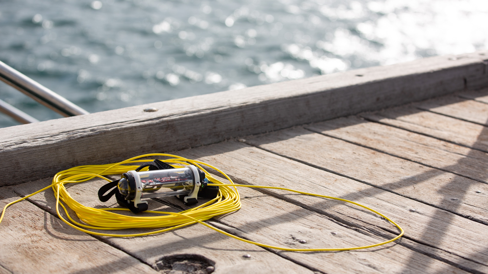
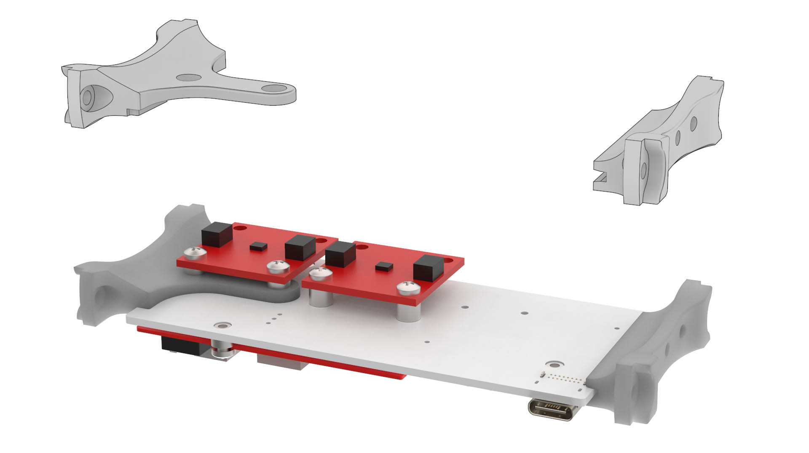

# Underwater Sensor Node with Single Pair Ethernet
Prototype project to build a underwater sensor node, powered by and communicating with the surface via Single Pair Ethernet (10BASE-T1L + 802.3cg Type E Class 10-12).

A more detailed write-up can be [read on Electric UI's blog](https://electricui.com/blog/spe-sensor-node).

# Mechanical

## Housing

The body of the sensor node is a 2″ acrylic tube (*~58mm OD*), with a pair of aluminium end-caps. This provides a working volume constrained by the 50 mm internal diameter and ~118 mm maximum gap between caps.

The top cap/bulkhead has 4×M10 threaded holes for accessories as part of BlueRobotic's hardware ecosystem. The assembled prototype is fitted with:

- 4.5mm Wetlink penetrator for the tether cable
- 10m rated pressure sensor
- White indicator LED
- Pressure relief/test valve

Whilst this prototype won't see properly deep water, this tube arrangement should be capable of  200m operation, and far deeper if an aluminium sleeve is used.

CAD models and assemblies are in `/mechanical/tube/`. Off-the-shelf parts are in `/mechanical/tube/cots/`.

## Internal brackets

A pair of 3D printed board mounts use the 4×M3 internal mounting holes in the bulkheads.

CAD models and STL files are in `/mechanical/tube/`. 

## Mounting

The tube itself doesn't have any features for mounting, so a pair of custom tube clamps were printed with the general goal of providing generic strap or wire mounting points. 

Files are in `/mechanical/mount/`.

# Electronics

Compatibility with the [Sparkfun MicroMod ecosystem](https://www.sparkfun.com/micromod) has been maintained where possible - building off of [Sparkfun's ADIN1110 function board](https://www.sparkfun.com/products/19038) for bring-up and early software tests.

PCB's were designed with KiCAD 7. Project files, gerbers and schematic PDF's are in `/electronics/`.

A small collection of calculator spreadsheets were made to help during the design process - these are in `/docs` and use Open Office `.ods` format.

Version 1.0 boards do have some minor issues which were tweaked during bench testing, so I'd recommend reviewing things thorough before copying anything into your designs.

## Backplane

Acting as the MicroMod 'carrier', providing the processor and function board connections, as well as regulation, I2C headers, and breakout pads for spare/conflicted IO. It also serves as the mounting interface for sensor payloads and custom hardware. 

It's a 46×100 mm 1.6 mm 2-layer board with pretty relaxed fabrication requirements. 

## PD and PSE Function Boards

Both boards implement the ADIN1110 SPE transceiver in a similar manner to Sparkfun's function board, but exist as two variants which improve over the dev-kit by adding:

- Circuitry to act as a Class 10-12 PoDL **power supply** aka PSE (pictured below on left).

- VID circuitry to signal compliance as a Class 10-12 PoDL **powered device** aka PD (pictured on right).

  

> These boards only provide detection, not classification via SCCP, and as such runs in 'fast-start mode'.

The PCB's are A×B mm, 0.8mm thick, 2-layer boards which can be manufactured with commodity fabs. I just used the raw straight PCB edge-connector without issues, but for best practice and/or frequent insertion cycles the edge-connector should be bevelled.

The blog post describes PoDL circuit behaviour and integration in more detail.

## Sensors

The project was designed without assuming any specific sensors would be used, but I used these I2C sensors:

- Temperature & Humidity - `SHTC3` via [Sparkfun `SEN-16467`](https://www.sparkfun.com/products/16467)
- Motion - `LSM6DSO` via [Sparkfun `SEN-18020`](https://www.sparkfun.com/products/18020)
- Depth/Pressure - `MS5837` via [BlueRobotics `Bar02`](https://bluerobotics.com/store/sensors-cameras/sensors/bar02-sensor-r1-rp/)

# Firmware

I used an ESP32 MicroMod processor board along with the Arduino toolchain. As such, there are external dependencies on the ESP32 Arduino core, [`electricui-embedded`](https://github.com/electricui/electricui-embedded), and Sparkfun packages for their [ESP32 boards](https://github.com/sparkfun/Arduino_Boards), [`LSM6DS0`](https://github.com/sparkfun/SparkFun_Qwiic_6DoF_LSM6DSO), [`SHTC3`](https://github.com/sparkfun/SparkFun_SHTC3_Arduino_Library) and [`ADIN1110`](https://github.com/sparkfun/SparkFun_ADIN1110_Arduino_Library) libraries.

I also depend on my own [`MS5837`](https://github.com/Scottapotamas/MS5837) library (external to this repo) for working with the pressure sensor.

The `/firmware` folder has some of the test-sketches written during testing:

- `spe-pse-io` - Bench-test PoDL PSE behaviour with a simple state-machine
- `lsm6ds0-fifo-test` - Configures and reads IMU samples periodically from the buffer
- `led-io-test` - Rough test using Pololu's APA102 library to check the 2×24 LED rings
- `spe-eui-bridge` - Transparent proxy of `electricui-embedded` packets with ADIN1110 raw buffers to serial ports.

> These sketches weren't written to act as examples or as reference material, and should be treated accordingly.

The main firmware is actually rather straightforward, running a superloop which runs each sub-system at a defined rate. Sub-systems never block, and are generally only responsible for their own behaviour. 

> **TODO: Cleanup and merge branches/sources into this repo**

# User Interface

> **TODO: Cleanup and merge sources into this repo**

The user interface is built with [Electric UI](https://electricui.com), and can be built and run by invoking `arc start` from `/interface`.

It handles visualisation of data streaming off the sensor node, and provides additional statistics and logging.

**TODO: Write part 2 post on data processing and visualisation**

# Additional Notes

_If_ you're planning on replicating this project, or part of it, some additional points of interest:

- I'm happy to answer questions or help with design changes to suit your ocean research project.
  - I'm also generally open to consulting work!
- Firmware is pretty specific to my own tooling and relies on external libraries for sensors and the Arduino ESP32 core.
- Read over BlueRobotics's guides for Wetlink penetrator use, enclosure assembly, pressure testing.
  - Definitely do remember to lubricate o-rings and the tube bulkheads as you slide them into the cylinder. It's _very difficult_ to get them out dry... 
- The tube *as designed and pictured* is positively buoyant and might need additional ballast weight depending on your application and safety requirements around handling.

Its also worth mentioning that the entire detailed conceptualisation, design, ordering, assembly, testing and writeup occurred in August 2023. There were many late nights, and as a result some design choices were made with simplicity or time-frame in mind.
